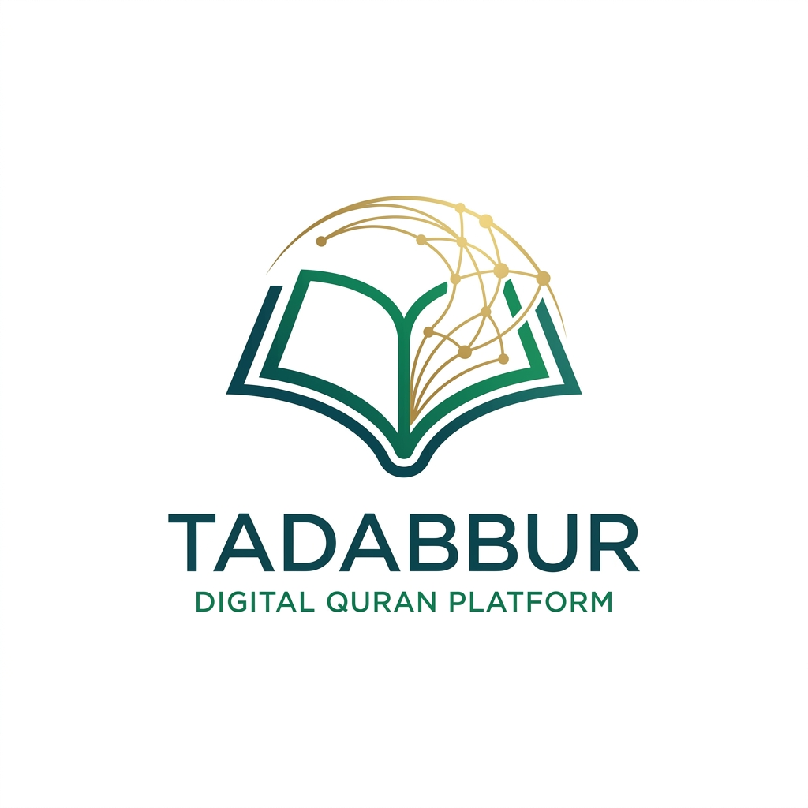

<div align="center">
  
  <br>
  <h1>✨ منصة تدبر القرآنية | Tadabbur Platform</h1>
  <p align="center">
    <b>مشروع تقني متكامل يجمع بين روحانية النص القرآني وأحدث تقنيات الويب والذكاء الاصطناعي.</b>
  </p>

  <p align="center">
    
    
    
    
  </p>

  <p align="center">
    <a href="#-المميزات-الرئيسية">المميزات</a> •
    <a href="#-الارتقاء-التقني-Premium-Elevation">التطوير الحديث</a> •
    <a href="#-التقنيات-المستخدمة">التقنيات</a> •
    <a href="#-المطور">المطور</a>
  </p>
</div>

---

## 🌟 نبذة عن المشروع
**تدبر** هي منصة ذكية مصممة لتكون رفيقك في رحلة فهم وتدبر كتاب الله. تهدف المنصة إلى تحويل النص القرآني من نصوص خطية إلى **شبكة معرفية مترابطة**، مما يسمح للمتدبر برؤية الروابط الخفية بين السور والمواضيع والمفاهيم باستخدام تقنيات علم البيانات وقواعد البيانات الرسومية.

---

## 🚀 المميزات الرئيسية

- **🧠 الرسم البياني للمفاهيم (Knowledge Graph):** تصور تفاعلي ثلاثي الأبعاد للروابط الموضوعية بين السور والمواضيع.
- **⚡ أداء فائق (Virtualization):** معالجة وعرض البيانات الضخمة بسلاسة تامة حتى مع مئات المراجع.
- **🖼️ مشاركة جمالية:** إمكانية تحويل الآيات والأدعية إلى بطاقات دعوية مصممة بأناقة للمشاركة على وسائل التواصل.
- **🔍 بحث ذكي ولحظي:** محرك بحث متقدم يغطي النصوص، المقاصد، والتخصصات العلمية للآيات.
- **📱 PWA (تطبيق ويب تقدمي):** إمكانية تثبيت المنصة على الهاتف والوصول إليها كأنها تطبيق أصلي.

---

## 📈 الارتقاء التقني (Premium Elevation)
تم ترقية المنصة مؤخراً لتصل إلى مستوى عالمي من الجودة التقنية:

> [!IMPORTANT]
> **التحديثات الأخيرة:**
> - **Visual Excellence:** إضافة خلفيات متحركة (Geometric Motion) وتفاعلات دقيقة لتعزيز الجمالية.
> - **60FPS Optimization:** تطبيق تقنيات الـ Virtualization لضمان انسيابية الحركة في القوائم الطويلة.
> - **Search Engine Authority:** دمج بيانات JSON-LD المنظمة لتحسين ظهور المنصة في نتائج البحث العالمية.
> - **Advanced Caching:** استخدام `TanStack Query` لإدارة البيانات وتوفير تجربة خالية من الـ Loading.

---

## 🛠️ التقنيات المستخدمة

### 🎨 Frontend Ecosystem
- **React 19 & Vite:** أساس التطبيق لسرعة الاستجابة.
- **Framer Motion:** للحركات السينمائية والانتقالات الانسيابية.
- **Tailwind CSS:** تصميم عصري متجاوب بالكامل.
- **Recharts & Force-Graph:** لتصور البيانات والرسوم البيانية.

### ⚙️ Backend & Data
- **FastAPI (Python):** محرك المعالجة والـ API.
- **Neo4j:** العقل المدبر لتخزين الروابط المعرفية (Graph Knowledge).
- **PostgreSQL:** المستودع الآمن للنصوص والتفاسير.
- **Playwright Pipelines:** سكربتات متطورة لسحب وتحليل البيانات من المصادر الموثوقة.

---

## 💻 كيفية التشغيل

```bash
# تشغيل الواجهة الأمامية
cd tadabbur-ui
npm install
npm start

# تشغيل الواجهة الخلفية
cd tadabbur-data/Scripts
uvicorn main:app --reload
```

---

## 🤝 المطور
**الحسن جمال (Alhassan Gamal)**  
عالم بيانات وخبير في الذكاء الاصطناعي، يجمع بين التقنية وخدمة القرآن الكريم.

<p align="center">
  <a href="https://github.com/alhasangamal">
    
  </a>
  <a href="https://www.linkedin.com/in/alhasan-gamal-480473173/">
    
  </a>
</p>

---
<p align="center">
  <i>"كِتَابٌ أَنزَلْنَاهُ إِلَيْكَ مُبَارَكٌ لِّيَدَّبَّرُوا آيَاتِهِ وَلِيَتَذَكَّرَ أُولُو الْأَلْبَابِ"</i>
</p>
